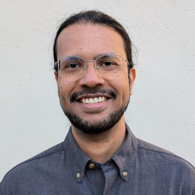

# Ravi Murugesan

Library Coordinator & Technical Communicator
{: .fs-6 .fw-300}

I work as the public services coordinator in the science and engineering libraries at Princeton University. I also teach a summer course in technical communication at Kyushu University. This site contains my portfolio, which I use primarily for teaching and demonstration.

[My LinkedIn profile](https://www.linkedin.com/in/ravimurugesan/).

[My ORCID record](https://orcid.org/0000-0002-1898-0559).
